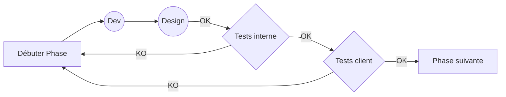

# Nymphea guide de programmation

Préconisations pour une programmation simple et efficace

**Cycle de développement :**

Note :
install mermaid pour voir les schemas ( https://chrome.google.com/webstore/detail/github-%2B-mermaid/goiiopgdnkogdbjmncgedmgpoajilohe/related )

# Règles générales

1. Schématiser et nommer l'ensemble des éléments de votre programme
2. Utiliser des noms explicites et  pour vos variables et fonctions
3. Programmer et commenter (io only) en anglais
4. Ecrire selon la norme "Camel Case" 
5. Chaque fonction effectue une tâche unique et précise
6. Ne pas dupliquer de code

# Javascript

coming soon

# PHP

coming soon

